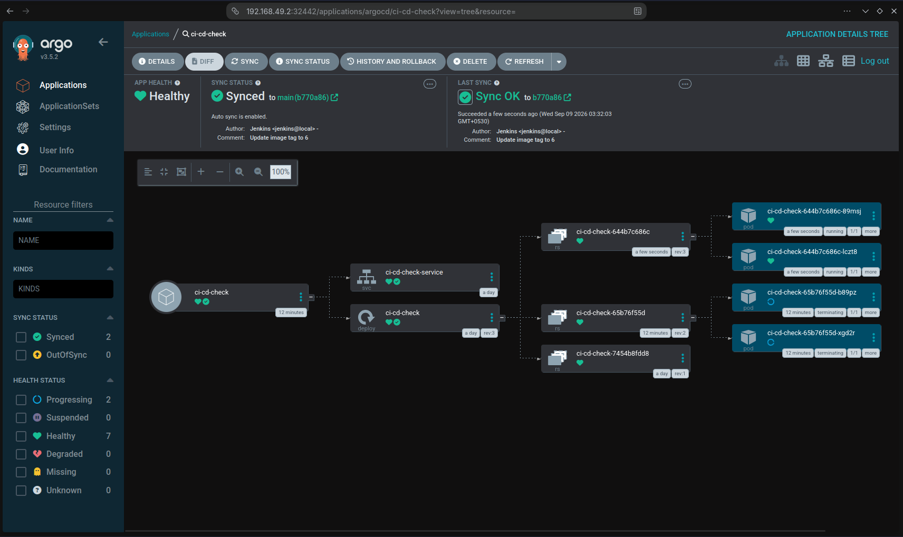

# ci-cd-check-manifest

Kubernetes manifests for the ci-cd-check application. This repository is monitored by Argo CD and serves as the GitOps source of truth for cluster deployments.

## Related Repository

Application repository:
https://github.com/mimo-to/ci-cd-check

## Workflow

1. Jenkins builds and pushes a new Docker image.
2. Jenkins updates the image tag in `k8s/deployment.yaml`.
3. Jenkins pushes the change to this repository.
4. Argo CD detects the update and syncs the manifests to the Kubernetes cluster.

## Manifests

- `k8s/deployment.yaml` - Deployment definition for `mimo017/ci-cd-check` (2 replicas).
- `k8s/service.yaml` - NodePort service exposing the application.

## Deployment Flow

```text
Application Repository
        │
        ▼
      Jenkins
        │
        ▼
 Updates Image Tag
        │
        ▼
Manifest Repository
        │
        ▼
      Argo CD
        │
        ▼
 Kubernetes Cluster
```

## Screenshot

### Argo CD Sync Status

